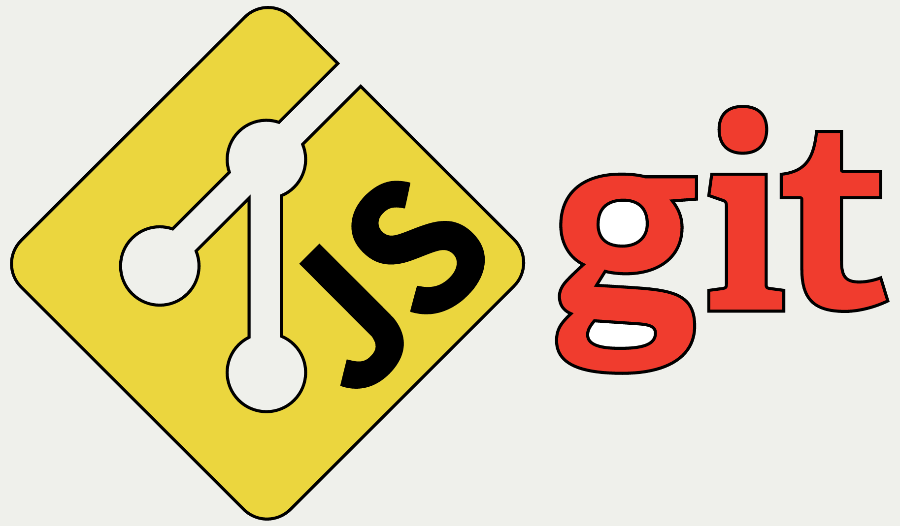

# MoonSlice

## Continuing Innovation in node.js API Design

By Tim Caswell


## Background

 - I've worked on [node.js](http://nodejs.org/) a *long* time.
 - I spent a year porting node.js to [Lua]() as [luvit](http://luvit.io/).
 - I've spent the last few months porting [git](http://git-scm.com/) to [JavaScript](https://developer.mozilla.org/en-US/docs/Web/JavaScript) as [js-git](https://github.com/creationix/js-git).





## Discoveries

 - While working on these I've discovered a need for simple common interfaces for loosly coupled protocol codecs.
 - Running code in a variety of platforms and frameworks is tricky.
 - Simple and dependency-free interfaces are needed for basic things like data streams and async results.


# State Machines

## The bread and butter of protocol streams.


## Decoupled Codecs

 - Codecs are parsers, decoders, encoders, etc...
 - Basically anything that translates from one protocol or representation to another.
 - Codecs should not care or even know about your program's I/O model.
 - They only care about consuming data and emitting data.


## Streaming JSON Decoder

```javascript
var decoder = JSON.createDecoder(emit);

decoder.write('{"name":"Tim');
decoder.write(' Caswell"}[1');
decoder.write(',2,3][4,5,6]');

decoder.end();
```

```javascript
{ name: 'Tim Caswell' }
[ 1, 2, 3 ]
[ 4, 5, 6 ]
```


## Streaming JSON Encoder

```javascript
var encoder = JSON.createEncoder(console.log);

encoder.write({ name: 'Tim Caswell' });
encoder.write([ 1, 2, 3 ]);
encoder.write([ 4, 5, 6 ]);

encoder.end();
```

```javascript
'{"name":"Tim Caswell"}'
'[1,2,3]'
'[4,5,6]'
```


## JSON Encoder

```javascript
json = JSON.stringify({name: 'Tim Caswell'});
json = JSON.stringify([1, 2, 3]);
json = JSON.stringify([4, 5, 6]);
```

 - Use the right tool for the job.
 - Input to output is 1:1, so a plain function is fine.


## Streaming HTTP Parser

```javascript
var parser = HTTP.createParser(console.log);

parser.write('GET / HTTP/1.1\r\nHost: ');
parser.write('creationix.com\r\nConnec');
parser.write('tion: Keep-Alive\r\n\r\n');
parser.write('GET /favicon.ico HTTP/1.');
parser.write('1\r\nHost: creationix.co');
parser.write('m\r\nConnection: Close\r');
parser.write('\n\r\n');

parser.end();
```


## Sample HTTP Output

```javascript
{
  method: 'GET', path: '/',
  headers: [
    [ 'Host', 'creationix.com' ],
    [ 'Connection', 'Keep-Alive' ]
  ]
}
{
  method: 'GET', path: '/favicon.ico',
  headers: [
    [ 'Host', 'creationix.com' ],
    [ 'Connection', 'Close' ]
  ]
}
```


## Writing a push style transformer.

```javascript
// (push-stream) -> push-stream
function transformer(output) {
  // Once per stream setup area.
  return { write: write, end: end };

  function write(item) {
    // Once per item
    // here we can call output.emit 0-n times.
  }
  function end() {
    // Optionally cleanup state machine.
    // We can still emit and/or output.end.
  }
}
```


## Writing a push style transformer.

```javascript
// (emit) -> emit
function transformer(emit) {
  // Once per stream setup area.

  return function (item) {
    // Once per item area.
    // here we can call emit 0-n times.
  };

}
```


## Byte Oriented Parser

```javascript
// Get the starting state from a byte oriented
// parser.  It emits bytes back to us.
var state = inflate(onByte);

// When we get data, feed it in.
for (var i = 0; i < data.length; i++) {
  state = state(data[i]);
  // When the state machine is done,
  // it can return a falsy state.
  if (!state) return onParserDone();
}
```


## Nested Byte Parsers

```javascript
// An example state in our machine
function $before(byte) {
  // handle input
  // Hand control to the sub machine.
  return inflate(onInflate, $after);
}

function $after(byte) {
  // Inflate was done parsing and handed
  // control back to us.
  // ...
  return $someOtherState;
}
```


## Implementing a Byte Parser

```javascript
// Sub state machine for hex escaped characters
function hexMachine(emit) {
  var left = 4, num = 0;

  return $hex;

  function $hex(byte) {
    num |= parseHex(byte) << (--left * 4);
    if (left) return $hex;
    return emit(num);
  }

}
```


## How do I know which to use?

 - Use whichever format expresses your problem most closely.
 - Keep it minimal and only use dependencies for basic functionality.
 - People can always wrap your core logic in whatever interface they need.
 - Document and unit-test well.


# Continuables

## Simple Flow Control Primitives


## Continuables

```javascript
var continuable = fs.readFile("myFile.txt");
continuable(function (err, data) {
  if (err) throw err;
  // handle data.
})
```

 - Continuables are functions that accept a continuation body.
 - A cross between node-style callbacks and promises.
 - 100% simple convention.  No library required.


## Composable Helpers

```js
function init(conf, description, exclude) {
  return serial(
    fs.mkdir("."),
    parallel(
      fs.mkdir("branches"),
      write("config", conf),
      write("description", description),
      serial(
        fs.mkdir("info"),
        write("info/exclude", exclude)
      )
    )
  );
}
```


## Implementation of a Helper

```js
function serial() {
  var items = Arrayslice.call(arguments);
  return function (callback) {
    check();
    function check(err) {
      if (err) return callback(err);
      var next = items.shift();
      if (!next) return callback();
      next(check);
    }
  };
}
```


# Generators

## Resumable Function Bodies


## Generators

 - ES6 has a new feature called generators.
 - A generator function can yield a value and then later resume where it left off.
 - Combining generators with continuables allows for blocking code within an event loop!
 - Node.JS 0.11.3+ has generators built in behind a `--harmony_generators` flag.


## A Simple Generator

```javascript
function* fib() {
  var a = 1, b = 0;
  while (true) {
    yield a
    var temp = a;
    a = a + b;
    b = temp;
  }
}
```

 - Every time the generator is resumed, it will yield the next fibonacci value resuming where it left off.


## Generator Flow Control

```javascript
run(function* () {
  var repo = yield jsgit.repo("/path/to/repo");
  var head = yield repo.readRef("HEAD");
  var commit = yield repo.load(head);
  var tree = yield repo.load(commit.tree);
});
```

 - `run` is a tiny function that consumes continuables passing in callbacks to them and resumes the generator when the callback gets called.


## Generators are Shallow

```javascript
run(function* () {
  var names = yield fs.readdir("mydir");
  names.forEach(function (name) {
    var path = path.join("mydir/", name);
    var data = yield fs.readFile(path, "utf8");
    console.log(path, data);
  });
});
```

- This will **not** work.  You can't yield from the callback it's not a generator.


## Delegating Yield

```javascript
run(function* () {
  var names = yield fs.readdir("mydir");
  yield* each(names, function* (name) {
    var path = path.join("mydir/", name);
    var data = yield fs.readFile(path, "utf8");
    console.log(path, data);
  });
});

function* each(array, callback) {
  for (var i = 0, i < array.length; i++) {
    yield* callback(array[i]);
  }
}
```


# Simple Streams

## A Simpler Stream Interface


## Why New Streams

 - Node Sterams are complex. (Though the docs are improving)
 - Now with streams 2 *and* old streams, they are twice as complex.
 - Browsers don't have node streams nativly
 - I wanted something simple and cross-platform.
 - I don't want to depend on a library just to create a stream.


## Anatomy of a Simple Stream

```javascript
var stream = {
  read: function (callback) { /*...*/ },
  abort: function (callback) { /*...*/ },
};
```

 - Call read every time you want another data event.
   - The callback is the same `(err, item)` pattern as continuables and node callbacks.
 - Optionally call abort if you wish to notify the source you won't be consuming any more.
   - Abort calls the callback once it's cleaned up resources.


## Stream Sources

```javascript
// readStream(path) -> stream
var stream = fs.readStream("/path/to/file");
```

 - A source is simply a function that returns a stream.
 - Some may return the stream inside a continuable if they wish to do async work first.


## Stream Sinks

```javascript
// writeStream(path) -> sink
var sink = fs.writeStream("/path/to/newFile");
// Feed the data stream to the sink.
sink(stream);
```

 - A sink is any function that consumes a stream.
 - It pulls data from the stream and controls the max speed of the flow.


## Stream Transforms

```javascript
// parse(stream<json>) -> stream<objects>
var objectStream = parse(jsonStream);
```

 - Anything that accepts a stream and returns a new stream is a transform.
 - Remember the state machines from before, those are a great way to implement these.
 - Use common helpers so transform logic can be written in whatever format makes sense.


## Duplex Streams

```javascript
// Make an echo tcp server on port 8080
tcp.createServer(8080, function (stream) {
  // stream has { read, abort, sink } properties
  stream.sink(stream);
});
```

 - Duplex streams are simply streams that also are writable via a `.sink` property.
 - Examples are things like TCP sockets and pipes.


## Decoupling I/O from Protocol

 - Why do most frameworks and libraries couple HTTP with actual TCP servers?
 - Because *most* of the time, you will be using HTTP over TCP.
 - But what if you're not?


## Reasons to Decouple

 - Tests!
 - Multi-platform web apps.
 - Less dependencies


## A simple TCP interface

```javascript
var tcp = require('simple-tcp');
tcp.createServer(8080, function (socket) {
  // A client connected
  // socket = { read, abort, sink }
});
```

 - This interface is a standard simple-streams interface.
 - It implements some concrete network primitive.
 - But code that consumes this can easily be fed a mock interface.


## An HTTP Codec

```javascript
var tcp = require('simple-tcp');
var parser = require('http-request-parser');
var encoder = require('http-response-encoder');
tcp.createServer(8080, function (socket) {
  var httpSocket = parser(socket);
  // httpSocket = { read, abort }
  httpSocket.sink = function (stream) {
    socket.sink(encoder(stream));
  };
});
```

 - Notice that the two HTTP libraries are simply stream transforms.
 - They know nothing about the TCP server or that the stream is even over TCP.


## An HTTP API

 - request-parser: (stream&lt;binary>) &rarr; stream&lt;request>
 - response-encoder: (stream&lt;response>) &rarr; stream&lt;binary>
 - request-encoder: (stream&lt;request>) &rarr; stream&lt;binary>
 - response-parser: (stream&lt;binary>) &rarr; stream&lt;response>


## A Websocket API

 - decoder: (stream&lt;binary>) &rarr; stream&lt;message>
 - encoder: (stream&lt;message>) &rarr; stream&lt;binary>
 - Here "binary" means raw websocket protocol data including framing and masking.
 - "message" means the message body as a Buffer or String.


## A JSON API

 - decoder: (stream&lt;json>) &rarr; stream&lt;object>
 - encoder: (stream&lt;object>) &rarr; stream&lt;json>
 - Converts between raw JSON strings or buffers and JavaScript objects.


## A Web App Interface

```javascript
function app(request) {
  console.log(request.method, request.path);
  return "Hello World";
}
```

 - The web app knows nothing about TCP or even HTTP protocols.
 - It only knows the web app interface.


## The API

 - app(request) -> continuable&lt;response>
 - request = { method, path, headers, body }
 - response = { code, headers, body }
 - For ease of use, lots of sugar and shortcuts are added.


## Sane Defaults

 - `code` defaults to `200`
 - `headers` auto insert things like `Date`, `Content-Length`, `Content-Type`
 - If the return value is a string or a stream, that's the body.
 - For apps that can't return their result directly, returning a continuable is acceptable.


## Just a Sample Web Interface

 - I won't focus on the specefics of this sample web app interface.
 - The point is it's decoupled from the network stack.
 - App level unit tests can pass in directly request objects and expect back response objects.
 - No need for a real TCP server or even HTTP protocol codecs.


## Sample Test

```javascript
test("Root returns HTML", function (assert) {
  var request = {
    method: "GET", path: "/", headers: []
  };
  var result = app(request);
  normalize(result, function (result) {
    assert.equal(result.code, 200);
    // ... and more tests
    assert.end();
  });
});
```


# Abstraction


## Using abstraction correctly is essential to maintable software.


## Seperate Concerns

 - Each module should have clearly defined and natural responsibilities.
 - Use clear interfaces for module interop.
 - Network transports and protocols are great places to draw lines.
 - Dependencies are expensive, treat them as such.
 - If the dependency saves you more lines of code than is has in it, it's probably OK.


## Summary

 - State machines are awesome!
 - Continuables fill the gap between promises and callbacks.
 - Generators make serial logic natural.
 - Simple streams and stream oriented programming are great.
 - Never conflate physical transports with protocol codecs.


# Thank You!


# Questions?

- Tim Caswell <tim@creationix.com>
- <https://twitter.com/creationix>
- <https://github.com/creationix>
- <https://creationix.com>
